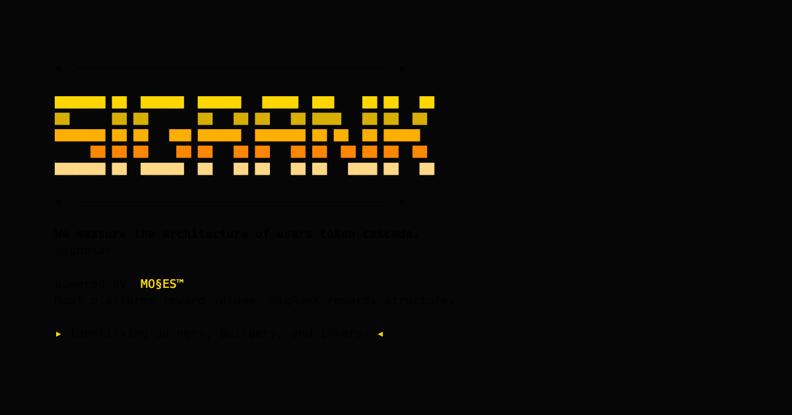

<div align="center">



# SigRank

**We measure the architecture of users' token cascade.**

Most platforms reward volume. SigRank rewards structure.

[](https://github.com/SunrisesIllNeverSee/sigrank-app/actions/workflows/ci.yml)
[](https://signalaf.com)
[](https://vercel.com)
[](https://nextjs.org)
[](https://react.dev)
[](https://www.typescriptlang.org)
[](./LICENSE)
[](https://supabase.com)
[](https://stripe.com)

</div>

---

> **Fair warning: the blade cuts both ways.**

A privacy-preserving leaderboard that scores AI operators on token cascade efficiency.
The rank metric: **Υ = (cache_read × output) / input²** — the yield cascade.

We measure the architecture of users' token cascade to identify patterns, margins, and
operator signature — revealing whether signal is compounded or tokens burned.

**Identifying Burners, Builders, and 10×ers.**

## Stack

- **Next.js 15** (App Router) + **React 19** + **TypeScript** (strict) + **Tailwind CSS**
- Pages are React Server Components by default; `'use client'` is added only to
  files that use hooks, handlers, or browser APIs.
- **Supabase** for data/auth, **Stripe** for billing — both reached through the
  `lib/data` facade so the app builds and every page renders with no creds
  present (deterministic mock fallback).

## Getting started

```bash
npm install
cp .env.example .env.local   # fill in Supabase + Stripe values when available
npm run dev
```

Visit http://localhost:3000.

The app is designed to build and render fully **without** any Supabase or Stripe
credentials. With no creds, the data facade serves deterministic mock data.

## Scripts

| Script          | Purpose                          |
| --------------- | -------------------------------- |
| `npm run dev`   | Start the dev server             |
| `npm run build` | Production build                 |
| `npm run start` | Serve the production build       |
| `npm run lint`  | Lint                             |

## Conventions

- **Scoring weights are server-only.** `lib/scoring/ruleset.ts` imports
  `server-only`; the RS.xx weights must never be imported into a client
  component or rendered into markup.
- **Placeholder vs real values.** Every placeholder number is wrapped in
  `<Placeholder/>` (gold ★ superscript + tooltip). Real values get a
  canonical-id superscript via `<CanonId/>` (`.canon-id`, green `.real`).
- **Deterministic data.** No random-number generation or wall-clock reads at
  module scope.

## Design tokens

`components/sigrank/tokens.ts` is the source of truth for colors and fonts. The
Tailwind theme in `tailwind.config.ts` mirrors those hex values (`bg-base`,
`class-transmitter` … `class-igniter`, `gold`, `accent`, etc.). Keep the two in
sync.

## Environment variables

See [`.env.example`](./.env.example) for the full list (Supabase, Stripe price
ids, grace period, site URL, `SIG_ARMY_DIR`, `RULESET_VERSION`). Values marked
`OPERATOR_OVERRIDE_REQUIRED` must be supplied by the operator before going live.

## Related

- **[sigrank-mcp](https://github.com/SunrisesIllNeverSee/sigrank-mcp)** — the CLI + MCP server. On-device token scanner, tabbed TUI dashboard, and MCP tools for AI clients. [`npm install -g sigrank-mcp`](https://www.npmjs.com/package/sigrank-mcp)
- **[signalaf.com](https://signalaf.com)** — the live board

## License

MIT — see [LICENSE](./LICENSE)
